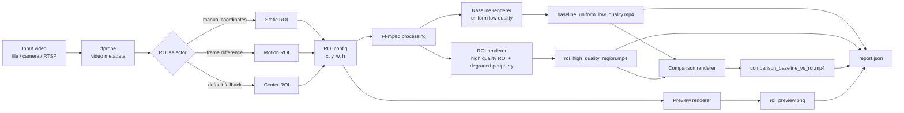
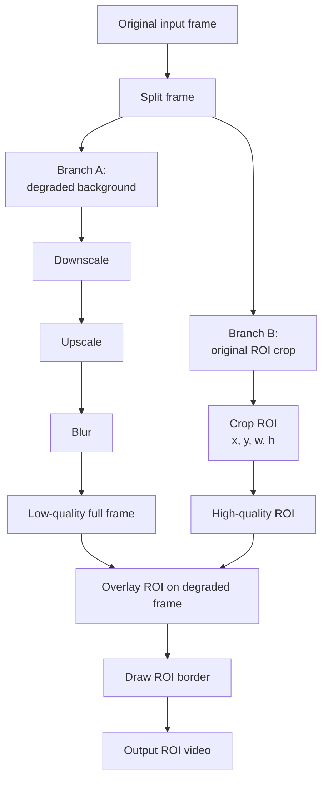
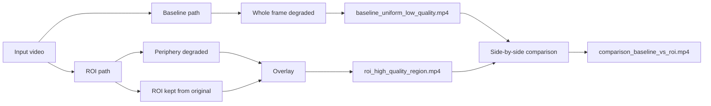
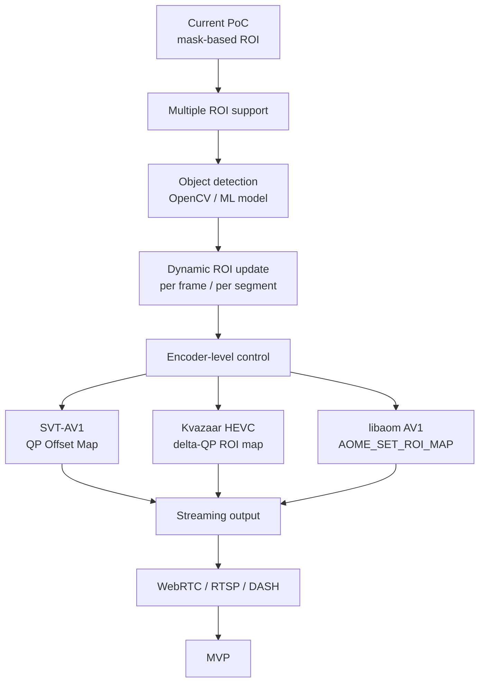

# ROI Video Streaming PoC на Go

PoC для проекта **ROI-based video streaming**.

Цель PoC — показать техническую реализуемость идеи: система получает видео, выделяет область интереса (**ROI, Region of Interest**) и применяет разное качество внутри одного кадра:

- ROI остаётся в высоком качестве;
- периферия кадра ухудшается;
- дополнительно создаётся baseline-вариант, где весь кадр ухудшен равномерно;
- результат можно сравнить side-by-side.

Этот PoC соответствует Этапу 3 проекта: демонстрация выделения ROI и управления качеством на уровне областей кадра.

---

## 1. Идея проекта

Обычное видеокодирование распределяет качество по кадру относительно равномерно. При ограниченном битрейте это приводит к тому, что важные области, например лицо, объект, зона движения или зона взгляда пользователя, тоже теряют качество.

ROI-based streaming решает эту проблему иначе:

```text
важная область кадра -> больше качества
остальная часть кадра -> меньше качества
```

В результате можно сохранить воспринимаемое качество в важных областях при меньшем расходе битрейта.

---

## 2. Что делает текущий PoC

Текущая версия — это **mask-based PoC**, а не финальная encoder-level реализация через QP-map.

Программа делает следующее:

1. Читает входное видео.
2. Получает параметры видео через `ffprobe`.
3. Выбирает ROI:
  - вручную через координаты;
  - автоматически через простую детекцию движения;
  - по центру кадра, если ROI не задана.
4. Создаёт baseline-видео:
  - весь кадр ухудшен равномерно.
5. Создаёт ROI-видео:
  - периферия ухудшена;
  - ROI вставлена из оригинального видео.
6. Создаёт side-by-side comparison:
  - слева baseline;
  - справа ROI-вариант.
7. Генерирует `report.json` с параметрами эксперимента.

---

## 3. Архитектура

### 3.1 Общий pipeline



---

### 3.2 Логика обработки ROI-видео



---

### 3.3 Сравнение baseline и ROI-подхода



---

## 4. Структура проекта

```text
roi-go-poc/
  go.mod
  README.md
  Dockerfile

  cmd/
    roi-poc/
      main.go
      server.go

  scripts/
    make_sample.sh

  docs/
    ARCHITECTURE.md
```

Описание основных файлов:

| Файл | Назначение |
|---|---|
| `cmd/roi-poc/main.go` | Основная CLI-программа: probing, ROI selection, FFmpeg pipeline, report |
| `cmd/roi-poc/server.go` | Простой HTTP-сервер для локального просмотра результатов |
| `scripts/make_sample.sh` | Генерация тестового видео с движущимся объектом |
| `Dockerfile` | Запуск PoC в контейнере |
| `docs/ARCHITECTURE.md` | Дополнительное описание архитектуры |

---

## 5. Требования

Нужно установить:

- Go 1.22 или новее;
- FFmpeg;
- FFprobe.

Проверка:

```bash
go version
ffmpeg -version
ffprobe -version
```

---

## 6. Сборка

Из корня проекта:

```bash
go build -o roi-poc ./cmd/roi-poc
```

После сборки появится исполняемый файл:

```text
roi-poc
```

---

## 7. Быстрый запуск на тестовом видео

Сначала сгенерируй тестовое видео:

```bash
chmod +x scripts/make_sample.sh
bash scripts/make_sample.sh
```

Затем собери и запусти PoC:

```bash
go build -o roi-poc ./cmd/roi-poc

./roi-poc \
  --input sample_motion.mp4 \
  --out demo_out \
  --mode motion
```

После выполнения в папке `demo_out` появятся результаты.

---

## 8. Результаты работы

Программа создаёт следующие файлы:

```text
demo_out/
  baseline_uniform_low_quality.mp4
  roi_high_quality_region.mp4
  comparison_baseline_vs_roi.mp4
  roi_preview.png
  report.json
```

Описание:

| Файл | Что показывает |
|---|---|
| `baseline_uniform_low_quality.mp4` | Весь кадр ухудшен равномерно |
| `roi_high_quality_region.mp4` | ROI сохранена в высоком качестве, периферия ухудшена |
| `comparison_baseline_vs_roi.mp4` | Главное видео для защиты: baseline vs ROI |
| `roi_preview.png` | Кадр с выделенной ROI |
| `report.json` | Параметры запуска, размер файлов, ROI, примерный битрейт |

Главный файл для демонстрации:

```text
demo_out/comparison_baseline_vs_roi.mp4
```

---

## 9. Режимы выбора ROI

### 9.1 Автоматическая ROI по движению

```bash
./roi-poc \
  --input input.mp4 \
  --out demo_motion \
  --mode motion
```

В этом режиме программа:

1. извлекает два кадра из видео;
2. считает разницу яркости;
3. находит область, где есть заметные изменения;
4. строит bounding box;
5. расширяет его через `--roi-margin`.

Дополнительные параметры:

```bash
./roi-poc \
  --input input.mp4 \
  --out demo_motion \
  --mode motion \
  --motion-window 0.7 \
  --motion-threshold 34 \
  --roi-margin 0.18
```

Параметры:

| Параметр | Значение |
|---|---|
| `--motion-window` | Временной промежуток между кадрами для анализа движения |
| `--motion-threshold` | Порог разницы яркости |
| `--roi-margin` | Расширение найденной области ROI |

---

### 9.2 Статическая ROI в пикселях

```bash
./roi-poc \
  --input input.mp4 \
  --out demo_static \
  --mode static \
  --roi 640,300,520,360
```

Формат:

```text
x,y,w,h
```

Где:

| Параметр | Значение |
|---|---|
| `x` | Координата левого верхнего угла по X |
| `y` | Координата левого верхнего угла по Y |
| `w` | Ширина ROI |
| `h` | Высота ROI |

---

### 9.3 Статическая ROI в долях кадра

Можно задавать ROI не в пикселях, а в долях от размера кадра:

```bash
./roi-poc \
  --input input.mp4 \
  --out demo_static_fraction \
  --mode static \
  --roi 0.30,0.20,0.40,0.45
```

Это означает:

```text
x = 30% ширины кадра
y = 20% высоты кадра
w = 40% ширины кадра
h = 45% высоты кадра
```

---

### 9.4 ROI по центру кадра

Если режим `static` указан, но координаты ROI не переданы, программа использует центральную область кадра:

```bash
./roi-poc \
  --input input.mp4 \
  --out demo_center \
  --mode static
```

---

## 10. Настройка качества

### 10.1 Сила деградации периферии

```bash
--periphery-scale 0.42
```

Чем меньше значение, тем сильнее ухудшается периферия.

Пример более сильной деградации:

```bash
./roi-poc \
  --input input.mp4 \
  --out demo_low_periphery \
  --mode static \
  --roi 0.30,0.20,0.40,0.45 \
  --periphery-scale 0.25
```

---

### 10.2 Blur периферии

```bash
--blur 2
```

Чем больше значение, тем сильнее размытие.

Пример:

```bash
./roi-poc \
  --input input.mp4 \
  --out demo_blur \
  --mode static \
  --roi 0.30,0.20,0.40,0.45 \
  --blur 4
```

---

### 10.3 CRF итогового файла

```bash
--crf 23
```

CRF управляет качеством итогового H.264-файла:

- меньше CRF — выше качество и больше размер;
- больше CRF — ниже качество и меньше размер.

Пример:

```bash
./roi-poc \
  --input input.mp4 \
  --out demo_crf \
  --mode motion \
  --crf 24
```

---

## 11. Локальная демонстрация через браузер

Можно запустить HTTP-сервер после обработки:

```bash
./roi-poc \
  --input input.mp4 \
  --out demo_out \
  --mode motion \
  --serve
```

После запуска открыть:

```text
http://localhost:8080/comparison_baseline_vs_roi.mp4
```

Можно изменить адрес:

```bash
./roi-poc \
  --input input.mp4 \
  --out demo_out \
  --mode motion \
  --serve \
  --http :9090
```

Тогда открыть:

```text
http://localhost:9090/comparison_baseline_vs_roi.mp4
```

---

## 12. Запуск через Docker

Сборка Docker-образа:

```bash
docker build -t roi-poc .
```

Запуск:

```bash
docker run --rm -v "$PWD:/work" roi-poc \
  --input sample_motion.mp4 \
  --out demo_out \
  --mode motion
```

Для своего видео:

```bash
docker run --rm -v "$PWD:/work" roi-poc \
  --input input.mp4 \
  --out demo_out \
  --mode static \
  --roi 0.30,0.20,0.40,0.45
```

---

## 13. Пример полного запуска для защиты

```bash
chmod +x scripts/make_sample.sh
bash scripts/make_sample.sh

go build -o roi-poc ./cmd/roi-poc

./roi-poc \
  --input sample_motion.mp4 \
  --out defense_demo \
  --mode motion \
  --periphery-scale 0.35 \
  --blur 3 \
  --crf 23
```

Открыть:

```text
defense_demo/comparison_baseline_vs_roi.mp4
```

Также можно показать:

```text
defense_demo/roi_preview.png
defense_demo/report.json
```

---

## 14. Что показывать на защите

Рекомендуемый порядок демонстрации:

1. Показать исходную идею:
  - при ограниченном битрейте не все области кадра одинаково важны.
2. Показать `roi_preview.png`:
  - система выделила ROI.
3. Показать `baseline_uniform_low_quality.mp4`:
  - обычный подход ухудшает весь кадр.
4. Показать `roi_high_quality_region.mp4`:
  - ROI остаётся качественной, периферия ухудшается.
5. Показать `comparison_baseline_vs_roi.mp4`:
  - наглядное сравнение baseline и ROI-подхода.
6. Показать `report.json`:
  - параметры эксперимента и размеры выходных файлов.

---

## 15. Что говорить на защите

Короткое объяснение:

> Этот PoC демонстрирует принцип ROI-based video streaming. Вместо равномерного распределения качества по всему кадру система выделяет область интереса и сохраняет её в высоком качестве, снижая детализацию периферии. Это позволяет показать, как можно экономить битрейт без сильной потери воспринимаемого качества в важных областях.

Важно уточнить:

> Текущая версия — это mask-based PoC. Она показывает техническую реализуемость идеи. На следующем этапе этот механизм можно заменить на encoder-level управление качеством через QP-map, ROI-map или tiles.

---

## 16. Ограничения текущего PoC

Текущая версия специально сделана простой и воспроизводимой.

Ограничения:

- используется одна ROI;
- motion detection простой и не является полноценной CV-моделью;
- качество меняется через FFmpeg mask/overlay pipeline;
- нет настоящей интеграции с QP-map энкодером;
- нет WebRTC/DASH-доставки;
- нет saliency/object detection;
- нет динамической ROI на каждом кадре в реальном времени.

---

## 17. Связь с будущим прототипом

Текущий PoC можно развивать в полноценный прототип.



---

## 18. Возможное развитие

Следующие шаги:

1. Добавить несколько ROI одновременно.
2. Добавить object detection:
  - лицо;
  - человек;
  - автомобиль;
  - выбранный объект.
3. Добавить saliency map.
4. Реализовать динамическое обновление ROI во времени.
5. Генерировать QP-map.
6. Подключить encoder-level ROI:
  - SVT-AV1;
  - Kvazaar;
  - libaom.
7. Добавить streaming output:
  - RTSP;
  - WebRTC;
  - DASH.
8. Добавить метрики:
  - bitrate;
  - ROI-PSNR;
  - ROI-SSIM;
  - ROI-VMAF;
  - latency.

---

## 19. CLI-параметры

| Параметр             | По умолчанию | Описание                                                  |
|----------------------|-------------:|-----------------------------------------------------------|
| `--input`            |            — | Входное видео, RTSP URL или другой FFmpeg-readable source |
| `--out`              |        `out` | Папка для результатов                                     |
| `--mode`             |     `static` | Режим ROI: `static` или `motion`                          |
| `--roi`              |            — | ROI в формате `x,y,w,h`, в пикселях или долях кадра       |
| `--periphery-scale`  |       `0.42` | Насколько уменьшать периферию перед обратным upscale      |
| `--blur`             |          `2` | Радиус blur для периферии                                 |
| `--crf`              |         `23` | CRF итогового H.264-видео                                 |
| `--preset`           |   `veryfast` | x264 preset                                               |
| `--motion-window`    |        `0.6` | Интервал между кадрами для motion ROI                     |
| `--motion-threshold` |         `34` | Порог разницы яркости                                     |
| `--roi-margin`       |       `0.18` | Расширение найденной motion ROI                           |
| `--serve`            |      `false` | Запустить HTTP-сервер после обработки                     |
| `--http`             |      `:8080` | Адрес HTTP-сервера                                        |
| `--keep-temp`        |      `false` | Не удалять временные кадры                                |

---

## 20. Пример `report.json`

Примерная структура отчёта:

```json
{
  "created_at": "2026-02-21T12:00:00+03:00",
  "input": "sample_motion.mp4",
  "mode": "motion",
  "video": {
    "width": 1280,
    "height": 720,
    "duration_seconds": 8,
    "fps": 30
  },
  "roi": {
    "x": 96,
    "y": 216,
    "w": 480,
    "h": 184,
    "source": "motion-diff"
  },
  "artifacts": [
    {
      "path": "demo_out/baseline_uniform_low_quality.mp4",
      "size_bytes": 123456,
      "bitrate_kbps": 123.45
    }
  ],
  "notes": [
    "PoC uses mask-based spatial quality redistribution.",
    "This demonstrates Stage 3 feasibility before moving to encoder-level QP/ROI maps."
  ]
}
```

---

## 21. Краткий вывод

Этот PoC показывает, что ROI-based streaming можно реализовать как воспроизводимый pipeline:

```text
input video -> ROI selection -> different quality per region -> comparison output
```

Для Этапа 3 этого достаточно: есть выделение ROI, управление качеством по областям кадра, baseline-сравнение, видео для демонстрации и отчёт.

Дальнейшее развитие — переход от mask-based обработки к настоящему encoder-level ROI через QP-map, ROI-map или tile-based delivery.