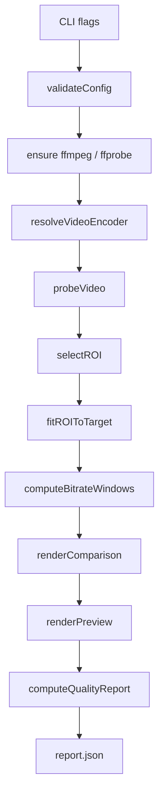
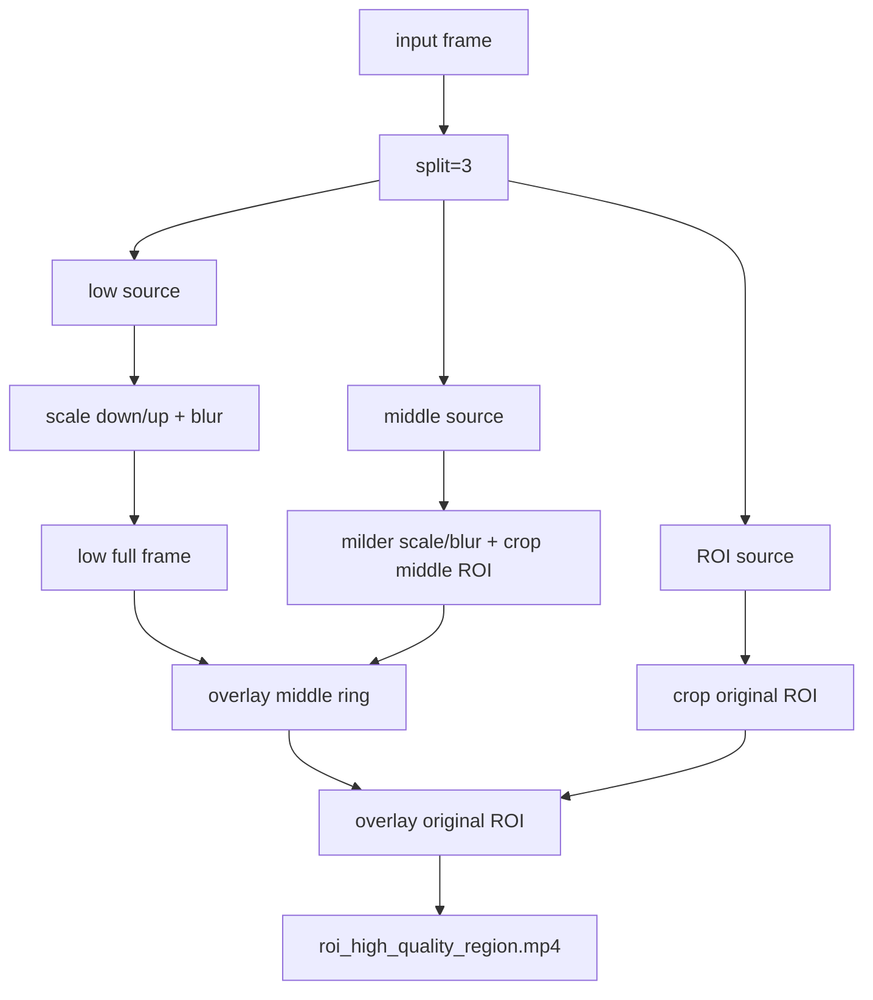

# ROI Video Streaming PoC

Этот документ описывает текущее состояние проекта по коду. `docs/research.md` не является источником этого описания.

## Назначение

Проект демонстрирует ROI-based video streaming на уровне PoC:

- входное видео остаётся baseline и не перекодируется;
- ROI output кодируется с приоритетом качества в выбранной области;
- вокруг ROI есть средняя зона, чтобы не было резкого разрыва качества;
- периферия ухудшается сильнее для экономии битрейта;
- comparison-видео показывает baseline и ROI output side-by-side с текущим битрейтом.

Это mask-based preprocessing через FFmpeg, а не настоящая encoder-level ROI/QP-map реализация.

## Pipeline



Фактический порядок находится в `internal/roi/app.go`.

## ROI output

`internal/roi/encode.go` строит FFmpeg filter graph в `buildROIFilter`:



Зоны на финальном comparison:

| Цвет      | Что означает                              |
|-----------|-------------------------------------------|
| 🟩 Green  | ROI, исходный crop перед финальным encode |
| 🟨 Orange | middle ring, среднее качество             |
| 🟥 Red    | low periphery, самое низкое качество      |

## Outputs

```text
roi_high_quality_region.mp4
comparison_baseline_vs_roi.mp4
roi_preview.png
bitrate_windows.json
report.json
quality_roi_psnr.json      # optional, when --metrics=true
```

`baseline_uniform_low_quality.mp4` больше не создаётся. Baseline в отчётах и comparison-видео - это исходный input.

## CLI examples

Сборка:

```bash
go build -o roi-poc ./cmd/roi
```

Быстрый тест:

```bash
./roi-poc \
  --input examples/ball.mp4 \
  --out out/ball_roi \
  --mode static \
  --roi 0.35,0.25,0.30,0.40 \
  --target-bitrate 500k \
  --bitrate-window 2 \
  --metrics=false \
  --encoder libx264
```

Motion ROI:

```bash
./roi-poc \
  --input input.mp4 \
  --out out/motion \
  --mode motion \
  --motion-window 0.7 \
  --motion-threshold 34 \
  --roi-margin 0.18
```

NVENC:

```bash
./roi-poc \
  --input input.mp4 \
  --out out/nvenc \
  --encoder h264_nvenc \
  --nvenc-preset p4 \
  --target-bitrate 800k
```

## Important flags

| Flag                 |  Default | Meaning                                   |
|----------------------|---------:|-------------------------------------------|
| `--input`            |        - | FFmpeg-readable source                    |
| `--out`              |    `out` | output directory                          |
| `--mode`             | `static` | `static` or `motion`                      |
| `--roi`              |        - | `x,y,w,h`, pixels or fractions            |
| `--target-bitrate`   |  `1000k` | target ROI output bitrate                 |
| `--fit-roi`          |   `true` | try candidates near target bitrate        |
| `--roi-rate-control` |    `abr` | `abr` or `crf`                            |
| `--roi-crf`          |     `16` | fixed-quality CRF / high quality baseline |
| `--middle-margin`    |   `0.35` | orange ring expansion                     |
| `--middle-scale`     |   `0.67` | orange ring scale                         |
| `--middle-blur`      |      `1` | orange ring blur                          |
| `--periphery-scale`  |   `0.35` | red zone scale when fitting is disabled   |
| `--blur`             |      `2` | red zone blur when fitting is disabled    |
| `--encoder`          |   `auto` | `auto`, `libx264`, `h264_nvenc`           |
| `--overlay-bitrate`  |   `true` | draw current bitrate labels               |
| `--bitrate-window`   |    `1.0` | seconds per bitrate window                |
| `--metrics`          |   `true` | compute ROI PSNR report                   |
| `--serve`            |  `false` | start local HTTP server                   |

## Encoder selection

`internal/roi/encoder.go` выбирает видео энкодер на основе флага `--encoder`:

- `--encoder auto` проверяет FFmpeg энкодеры используя `exec.Command("ffmpeg", "-hide_banner", "-encoders")`;
- если `h264_nvenc` доступен на текущей машине, NVENC будет использоваться для кодирования;
- иначе используется как дефолтный вариант `libx264`;
- дополнительно `--encoder h264_nvenc` выдает однозначную ошибку если FFmpeg не поддерживает его.

`libx264` поддерживает двухпроходный ABR-путь, используемый флагом `--roi-rate-control abr`. NVENC использует однопроходный путь с целевым битрейтом.

## Project layout

```text
├── Dockerfile
├── README.md
├── docs
│   └── ...    
├── cmd
│   └── roi
│       └── main.go
└── internal
    └── roi
        ├── app.go
        ├── bitrate.go
        ├── bitrate_test.go
        ├── cli.go
        ├── config.go
        ├── config_test.go
        ├── encode.go
        ├── encoder.go
        ├── encoder_test.go
        ├── exec.go
        ├── files.go
        ├── metrics.go
        ├── metrics_test.go
        ├── probe.go
        ├── probe_test.go
        ├── render.go
        ├── render_test.go
        ├── roi.go
        ├── roi_test.go
        ├── selection.go
        ├── selection_test.go
        ├── server.go
        └── types.go
```

## Tests

```bash
go test ./...
go test ./... -cover
go vet ./...
```

Модульные тесты покрывают парсинг, валидацию конфигурации, выбор аргументов кодировщика, расчёт ROI, сводки по битрейту, парсинг метрик, экранирование текста при рендеринге и выбор кандидатов.

## Docker

Dockerfile использует многоэтапную сборку:

1. `golang:1.26-bookworm` собирает `/roi-poc` из `./cmd/roi`.
2. `debian:bookworm-slim` устанавливает `ffmpeg` и `ca-certificates`.
3. Финальный образ запускает `roi-poc` в `/work`.

Docker полезен для воспроизводимых демонстраций и для машин без локально настроенных Go/FFmpeg. Для самого алгоритма он не требуется.

```bash
docker build -t roi-poc .

docker run --rm -v "$PWD:/work" roi-poc \
  --input examples/ball.mp4 \
  --out out/docker_ball \
  --target-bitrate 500k
```

Для GPU-кодирования внутри Docker хост должен предоставлять NVIDIA runtime и устройства:

```bash
docker run --rm --gpus all -v "$PWD:/work" roi-poc \
  --input examples/ball.mp4 \
  --out out/docker_nvenc \
  --encoder h264_nvenc
```

## Соответствие технологий

Этот стек разумен для данного PoC:

* Go упрощает оркестрацию, валидацию, отчёты и модульные тесты.
* FFmpeg — подходящий инструмент для детерминированных локальных преобразований видео.
* FFprobe даёт данные на уровне пакетов для окон битрейта.
* Docker упаковывает runtime для повторяемых демонстраций.

Ресурсоёмкие части являются намеренной демонстрационной работой: повторное кодирование кандидатов во время подбора, side-by-side рендеринг и опциональные метрики PSNR. В production-пайплайне стриминга они были бы заменены или перенесены в offline-часть; online-путь должен использовать ROI-контроль на уровне кодировщика, QP maps, tiles или протокол адаптивного стриминга.

## Текущие ограничения

* только одна прямоугольная ROI;
* motion ROI использует разницу яркости между двумя кадрами;
* нет детекции объектов или модели saliency;
* нет realtime-отслеживания ROI по кадрам;
* нет слоя доставки WebRTC/DASH/RTSP;
* качество ROI сохраняется за счёт preprocessing перед финальным кодированием, а не за счёт настоящего per-block контроля кодировщика.
