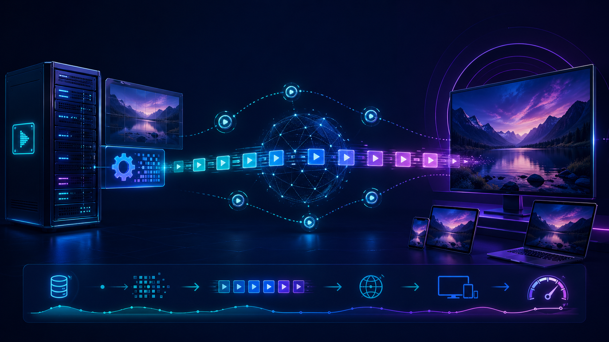
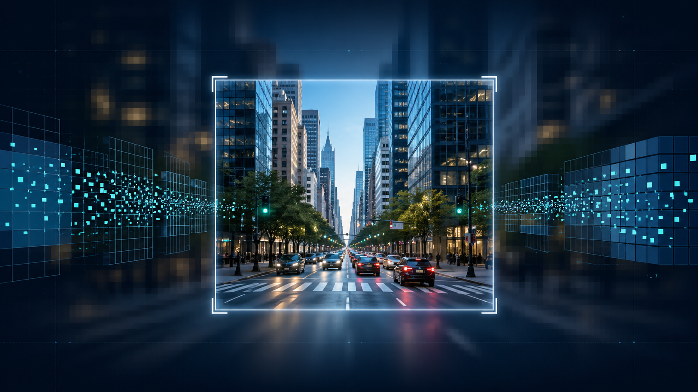

**ТЕХНИЧЕСКОЕ ЗАДАНИЕ**

**ROI-based video encoding**

Этап 2: представление проекта

| **Атрибут**         | **Значение**                                                                                        |
|---------------------|-----------------------------------------------------------------------------------------------------|
| **Тип проекта**     | Программный учебный проект                                                                          |
| **Цель продукта**   | Повысить качество важных областей видео при ограниченном битрейте за счет ROI-кодирования.          |
| **Базовое решение** | Offline/single-file encoding pipeline: входной видеофайл, ROI-разметка, кодирование, отчеты и демо. |

# 1. Резюме проекта

Проект разрабатывает инструмент для кодирования видео с учетом Region of Interest (ROI). Идея состоит в том, чтобы перераспределять качество внутри кадра: важные области кодируются лучше, а менее важные области могут кодироваться грубее. Это позволяет при заданном битрейте сохранить детализацию там, где она важнее всего: лицо, объект, зона движения, указатель оператора или выбранная пользователем область.

Проект не требует реализации потоковой передачи видео. Основной результат - воспроизводимый pipeline для обработки видеофайлов, генерации ROI-варианта, сравнения с baseline и сохранения отчетов.

## 1.1. Проблема

При ограниченном битрейте обычное равномерное кодирование ухудшает весь кадр. Из-за этого критически важные детали могут потеряться, хотя большая часть кадра может быть менее значимой для пользователя или алгоритма анализа.

## 1.2. Решение

Решение - адаптивное кодирование на основе ROI: модуль анализа кадра формирует ROI, затем ROI преобразуется в карту качества или маску, а encoder/output pipeline использует её для управления QP, битрейтом или tile-quality selection.

## 1.3. Решение для Этапа 2

Для Этапа 2 фиксируется базовая ветка реализации: offline ROI encoding pipeline. В PoC допускаются два подхода:

- encoder-level QP map через FFmpeg `addroi`;
- mask-based preprocessing через FFmpeg как визуально понятная fallback-демонстрация.

Streaming, WebRTC, DASH, RTSP и клиентская доставка не входят в обязательный объем проекта. Они могут быть упомянуты только как возможное дальнейшее развитие.

# 2. Термины и сокращения

| **Термин**             | **Определение**                                                                                          |
|------------------------|----------------------------------------------------------------------------------------------------------|
| **ROI**                | Region of Interest - важная область кадра, которую нужно сохранить в более высоком качестве.             |
| **Foveated streaming** | Частный случай ROI, где важная область соответствует зоне взгляда/фовеации.                              |
| **ROI encoding**       | Кодирование видео с неравномерным распределением качества между областями кадра.                         |
| **QP**                 | Quantization Parameter - параметр квантования; меньший QP обычно даёт лучшее качество и больший битрейт. |
| **QP offset map**      | Карта смещений QP по областям или блокам кадра, передаваемая энкодеру.                                   |
| **Mask**               | Маска/фильтр, который до кодирования ухудшает менее важные области кадра.                                |
| **QoE**                | Quality of Experience - воспринимаемое пользователем качество.                                           |

# 3. Целевая аудитория и сценарии

| **Сценарий**                      | **Польза**                                                                                                  |
|-----------------------------------|-------------------------------------------------------------------------------------------------------------|
| **Системы видеонаблюдения**       | Лица, номера, движущиеся объекты важнее фона. ROI позволяет экономить канал без потери критических деталей. |
| **Видеоконференции**              | Лица/говорящий важнее фона; можно улучшать воспринимаемое качество при фиксированном bitrate budget.        |
| **Cloud gaming / remote desktop** | Требуются низкая задержка и высокая детализация в зоне внимания. Приоритетна минимальная задержка.          |
| **VR/AR и 360°**                  | Viewport/gaze-driven зоны могут получать лучшее качество; это направление остается как дальнейшее развитие. |

# 4. Архитектура

Иллюстрация идеи: ROI кодируется качественнее, периферия может быть дешевле по битрейту.

| **Блок**               | **Назначение**                                                                                         |
|------------------------|--------------------------------------------------------------------------------------------------------|
| **1. Input**           | Получение видео из файла. Камера/RTSP не являются обязательными требованиями.                          |
| **2. ROI generator**   | Выделение ROI: static box, motion detection, ручная блочная QP-map; object detection как расширение.   |
| **3. Quality mapper**  | Преобразование ROI в QP offsets по областям/блокам или в mask-based preprocessing.                     |
| **4. Encoder**         | Кодирование ROI-варианта через FFmpeg, `libx264` или `h264_nvenc`.                                     |
| **5. Output**          | Сохранение выходного видеофайла, preview, side-by-side comparison и JSON/YAML отчетов.                 |
| **6. Evaluation**      | Расчет битрейта, размеров файлов, ROI-PSNR/SSIM/VMAF при наличии метрик, визуальное сравнение.         |

## 4.1. Архитектурное решение

Базовая ветка проекта - single-file ROI encoding. Система не обязана передавать видео по сети: она должна принимать видеофайл, кодировать ROI-вариант и сохранять результат локально.

Основной технический подход - QP-map через encoder-level ROI side data. Дополнительный mask-based режим сохраняется как наглядная демонстрация различий качества между ROI и периферией.

## 4.2. Возможные расширения

К дальнейшим расширениям можно отнести object detection, gaze/saliency detection, поддержку других энкодеров и потоковую доставку. Эти направления не являются критериями закрытия базового проекта.

# 5. Функциональные требования

| **ID**   | **Требование**                                                                                                       | **Этап**      |
|----------|----------------------------------------------------------------------------------------------------------------------|---------------|
| **F-01** | Система должна принимать видео из файла.                                                                             | PoC           |
| **F-02** | Система должна уметь задавать ROI вручную как static bounding box.                                                   | PoC           |
| **F-03** | Система должна поддерживать хотя бы один автоматический ROI-метод: движение или object detection.                    | PoC/Prototype |
| **F-04** | Система должна преобразовывать ROI в QP-map или mask-based представление для дальнейшего кодирования.                | PoC/Prototype |
| **F-05** | Система должна поддерживать блочную QP-map разметку ROI по сетке 64x64 с разными `qoffset`.                          | Prototype     |
| **F-06** | Система должна сохранять ROI-encoded видеофайл и логи/отчеты параметров кодирования.                                 | PoC           |
| **F-07** | Система должна формировать visual comparison: baseline без ROI и ROI-вариант с разметкой областей.                   | PoC           |
| **F-08** | Система должна считать bitrate, размер файлов и ROI-aware метрики качества при включении режима метрик.              | PoC/Prototype |
| **F-09** | Система должна иметь CLI/YAML-конфигурацию: вход, выход, ROI-метод, QP/битрейт, параметры энкодера.                  | Prototype/MVP |
| **F-10** | Система должна иметь минимальный UI для ручной разметки QP-map блоков и генерации YAML-конфига для encoder pipeline. | Prototype/MVP |
| **F-11** | Система должна иметь пользовательскую инструкцию и автономный локальный запуск.                                      | MVP/MUP       |

# 6. Нефункциональные требования

| **ID**    | **Категория**         | **Требование**                                                                                           |
|-----------|-----------------------|----------------------------------------------------------------------------------------------------------|
| **NF-01** | Воспроизводимость     | Команды запуска, версии инструментов и Dockerfile/README должны позволять повторить эксперимент.         |
| **NF-02** | Измеримость           | Каждый эксперимент должен сохранять параметры кодирования, битрейт, метрики качества и конфигурацию ROI. |
| **NF-03** | Расширяемость         | ROI detector/selection, quality mapper и encoder backend должны быть разнесены как отдельные модули.     |
| **NF-04** | Производительность    | Для базового проекта допускается offline encoding; желательно фиксировать время кодирования.             |
| **NF-05** | Качество демонстрации | Должно быть возможно визуально сравнить baseline и ROI-вариант на одном клипе.                           |
| **NF-06** | Кроссплатформенность  | CLI и минимальный UI должны запускаться локально на Windows, macOS и Linux при наличии Go и FFmpeg.      |

# 7. Технологический стек

| **Слой**                    | **Выбор**                                                                            | **Обоснование**                                                                               |
|-----------------------------|--------------------------------------------------------------------------------------|-----------------------------------------------------------------------------------------------|
| **ROI detection/selection** | Static bbox, motion detection, ручная блочная QP-map; object detector как расширение | Лёгкий старт, воспроизводимость и хорошая демонстрируемость.                                  |
| **Quality mapping**         | FFmpeg `addroi` QP offsets; mask-based preprocessing как fallback                    | Позволяет сравнить encoder-level ROI и визуально понятный preprocessing.                      |
| **Encoding primary**        | FFmpeg + H.264 (`libx264`/`h264_nvenc`)                                              | Доступно локально, хорошо подходит для учебного PoC и сравнения результатов.                  |
| **Metrics**                 | FFmpeg/ffprobe; PSNR/SSIM/VMAF и ROI-mask metrics при наличии поддержки              | Метрики позволяют оценить не только общий файл, но и качество важной области.                 |
| **UI**                      | Минимальный локальный browser UI на Go HTTP server                                   | Кроссплатформенно и просто: сервер отдает страницу, принимает карту блоков и генерирует YAML. |
| **Runtime**                 | Go CLI + FFmpeg + YAML config                                                        | Достаточно для автономного запуска и повторяемости экспериментов.                             |

## 7.1. Проверка реализуемости по источникам

SVT-AV1 документирует ROI/QP Offset Map file: строка содержит номер кадра и QP offsets для 64x64 блоков, а пример запуска использует `--roi-map-file` [S1].

Kvazaar поддерживает параметр `--roi <filename>`, который читает delta QP map из text/bin файла и масштабирует карту под размер видео [S2].

FFmpeg `addroi` позволяет передавать encoder-level ROI side data в pipeline. Фактический эффект зависит от поддержки энкодера и режима adaptive quantization [S3].

# 8. План реализации по этапам

| **Этап** | **Название**          | **Статус**                    | **Критерий закрытия**                                                            |
|----------|-----------------------|-------------------------------|----------------------------------------------------------------------------------|
| **1**    | Выбор темы            | Готово                        | Тема ROI-based video encoding подтверждена.                                      |
| **2**    | Представление проекта | Готовится этим пакетом        | Слайды + ТЗ + архитектура + план PoC.                                            |
| **3**    | PoC                   | Реализован mask-based вариант | Видео in/out, ROI, baseline vs ROI, отчеты, короткое демо.                       |
| **4**    | Прототип              | Следующий                     | QP-map, mask mode, YAML-конфиг, блочная ROI-разметка, базовые метрики.           |
| **5**    | MVP                   | TODO                          | Автономный запуск, CLI/UI, выбор алгоритма и локальный вывод файлов.             |
| **6**    | MUP                   | TODO                          | Пользовательская проверка, инструкция и отзыв.                                   |
| **7**    | Защита                | TODO                          | Результаты экспериментов, демо, отчеты, ответы на вопросы.                       |

# 9. Метрики

| **Группа**             | **Метрики**                        | **Зачем**                                                    |
|------------------------|------------------------------------|--------------------------------------------------------------|
| **Bitrate**            | avg, p95/p99, размер файла         | Показывает, насколько результат укладывается в bitrate goal. |
| **Full-frame quality** | PSNR, SSIM, VMAF                   | Контроль общего ухудшения кадра.                             |
| **ROI quality**        | ROI-PSNR/SSIM/VMAF по маске        | Главная метрика: важная зона должна сохраняться лучше.       |
| **Out-of-ROI quality** | PSNR/SSIM/VMAF по обратной маске   | Контроль чрезмерной деградации периферии.                    |
| **Encoding cost**      | время кодирования, CPU/GPU usage   | Помогает сравнить режимы и энкодеры.                         |

# 10. Риски и ограничения

| **ID**   | **Риск**                         | **Митигация**                                                                                       |
|----------|----------------------------------|-----------------------------------------------------------------------------------------------------|
| **R-01** | ROI выбран неверно               | Начать со static ROI и ручной блочной разметки; добавить preview и логи выбранных областей.         |
| **R-02** | Сложная поддержка QP-map         | Использовать FFmpeg `addroi`; оставить mask-based режим как fallback и визуальную демонстрацию.     |
| **R-03** | Переусложнение сетевой доставки  | Не включать streaming в обязательные требования; ограничиться локальным output file.                |
| **R-04** | Артефакты на границах ROI        | Использовать middle-зоны, блочную разметку и разные уровни `qoffset`.                               |
| **R-05** | Метрики не отражают QoE          | Считать ROI и full-frame метрики раздельно; дополнить визуальным comparison.                        |
| **R-06** | Разная поддержка энкодеров       | Документировать ограничения `libx264`/`h264_nvenc`; проверять fallback-настройки.                   |
| **R-07** | Лицензии и датасеты              | Проверять лицензии моделей, видео и сборок FFmpeg перед публикацией.                                |

# 11. Источники

| ID     | Источник                                          | Для чего используется                  |
|--------|---------------------------------------------------|----------------------------------------|
| **S1** | SVT-AV1 documentation, RoiMapFile / QP Offset Map | encoder-level ROI/QP-map ветка         |
| **S2** | Kvazaar README, `--roi <filename>`                | HEVC delta-QP ROI map                  |
| **S3** | GPAC DASH SRD / HEVC tiling howto                 | tile/subpicture delivery ветка         |
| **S4** | Netflix VMAF / FFmpeg libvmaf documentation       | full-frame и ROI-aware quality metrics |
| **S5** | Shaka Packager / MPEG-DASH tooling                | packaging для DASH-сценариев           |
| **S6** | W3C WebRTC API                                    | real-time delivery ветка               |
| **S7** | AV1 RTP payload specification                     | AV1/WebRTC delivery ветка              |
