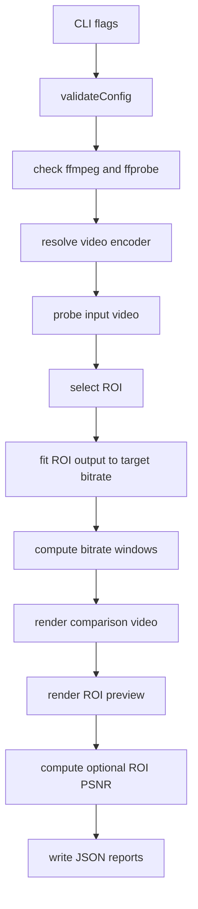
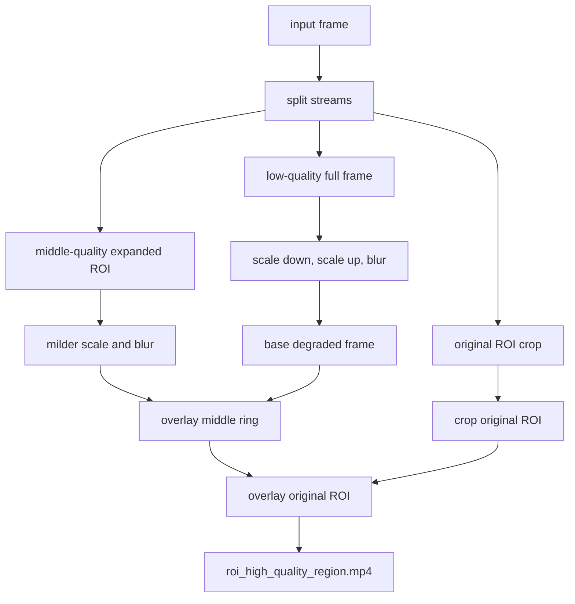

# Обзор проекта

ROI Based Video Streaming - учебный PoC, который демонстрирует идею перераспределения качества внутри видеокадра. Важная область кадра, Region of Interest, сохраняется ближе к исходнику, а менее важные области ухудшаются сильнее, чтобы снизить общий bitrate.

Практические команды запуска, Docker и troubleshooting вынесены в корневой [README.md](../README.md). Этот документ описывает смысл проекта, текущую архитектуру и ограничения реализации.

## Цель

Проблема, которую показывает проект: при ограниченном bitrate обычное равномерное кодирование ухудшает весь кадр одинаково, хотя зрителю часто важна только часть изображения. ROI-подход пытается сохранить качество значимой области и пожертвовать периферией.

Типичные области применения:

- видеоконференции, где важны лица и жесты;
- видеонаблюдение, где важны люди, транспорт или зоны контроля;
- VR/AR и foveated rendering, где важна область взгляда;
- облачный гейминг и интерактивные трансляции;
- edge-сценарии с ограниченным каналом передачи.

## Текущее состояние

Реализация находится на уровне PoC:

- входное видео используется как baseline и не перекодируется;
- ROI output создается через FFmpeg filter graph;
- поддерживается одна прямоугольная ROI;
- ROI можно задать вручную или выбрать простой motion-эвристикой;
- вокруг ROI создается middle ring, чтобы переход качества был менее резким;
- периферия кадра downscale/upscale и blur ухудшают менее важную область;
- результат кодируется в H.264 через `libx264` или `h264_nvenc`;
- сравнение сохраняется как side-by-side видео с bitrate overlay;
- отчеты пишутся в JSON.

Это не production streaming stack и не настоящий encoder-level ROI/QP-map. Качество распределяется preprocessing-ом до финального encode.

## Pipeline

Фактический порядок выполнения описан в `internal/roi/app.go`.



## Как формируется ROI output

`internal/roi/encode.go` строит FFmpeg filter graph, который разделяет кадр на несколько веток качества:



На финальном comparison-видео зоны размечаются так:

| Цвет | Зона | Смысл |
|------|------|-------|
| Green | ROI | область с максимальным сохранением деталей |
| Orange | Middle ring | промежуточная зона вокруг ROI |
| Red | Periphery | сильнее деградированная периферия |

Разметка рисуется только на comparison-видео и не участвует в измерении bitrate самого ROI output.

## Выбор ROI

Поддерживаются два режима:

- `static` - ROI задается флагом `--roi` или берется из центра кадра;
- `motion` - ROI строится по разнице яркости между двумя кадрами.

`static` принимает координаты `x,y,w,h`:

- в пикселях, например `640,300,520,360`;
- в долях кадра, например `0.30,0.20,0.40,0.45`.

`motion` режим нужен для демонстрации идеи автоматического выбора ROI. Он не заменяет object detection, saliency detection или tracking.

## Битрейт и fitting

Целевой bitrate задается через `--target-bitrate`. При стандартном `--roi-rate-control abr` программа кодирует ROI output около указанного значения.

Когда `--fit-roi=true`, PoC подбирает деградацию периферии через interpolation search по упорядоченной лестнице `scale/blur`. Вместо полного линейного перебора он измеряет опорные кандидаты, интерполирует следующий индекс по target bitrate и добирает соседние уровни около найденного попадания. Подбор может учитывать ROI PSNR, чтобы не выбирать вариант с худшим качеством важной области при близком bitrate.

Для `libx264` ABR может использовать two-pass. Для `h264_nvenc` используется single-pass ABR.

## Конфигурация

CLI можно настроить через YAML-файл:

```bash
./roi-poc --config roi.yaml
```

YAML-файл также можно передать как позиционный `.yaml`/`.yml` аргумент. Ключи YAML совпадают с именами CLI-флагов без `--`, например `target-bitrate`, `fit-roi`, `periphery-scale`, `metrics`. Порядок применения конфигурации: дефолты, затем YAML, затем явно переданные флаги.

## Артефакты

Типичный запуск создает:

```text
roi_high_quality_region.mp4
comparison_baseline_vs_roi.mp4
roi_preview.png
bitrate_windows.json
report.json
quality_roi_psnr.json
```

Назначение:

- `roi_high_quality_region.mp4` - итоговый ROI output;
- `comparison_baseline_vs_roi.mp4` - визуальное сравнение input baseline и ROI output;
- `roi_preview.png` - preview выбранной ROI;
- `bitrate_windows.json` - bitrate по временным окнам;
- `report.json` - сводка запуска, параметров и артефактов;
- `quality_roi_psnr.json` - optional PSNR report, если включены метрики.

## Структура кода

```text
cmd/roi/main.go            CLI entrypoint
internal/roi/app.go        orchestration pipeline
internal/roi/cli.go        CLI flags
internal/roi/config.go     validation
internal/roi/roi.go        static and motion ROI selection
internal/roi/encode.go     ROI filter graph, candidates and fitting
internal/roi/encoder.go    libx264/NVENC selection and args
internal/roi/bitrate.go    bitrate windows from ffprobe packets
internal/roi/render.go     preview and comparison rendering
internal/roi/metrics.go    ROI PSNR metrics
internal/roi/server.go     local HTTP file server
```

## Технологический выбор

Go используется как слой orchestration: CLI, конфигурация, валидация, запуск внешних процессов, JSON-отчеты и тесты.

FFmpeg используется для тяжелой видеообработки: crop, scale, overlay, blur, drawbox, drawtext, PSNR и H.264 encode.

FFprobe используется для metadata и расчета bitrate windows по пакетам видео.

Docker нужен не для алгоритма, а для воспроизводимого запуска с готовым FFmpeg runtime.

## Ограничения

- одна прямоугольная ROI;
- нет object detection, saliency map или gaze tracking;
- нет realtime tracking ROI по каждому кадру;
- нет WebRTC, DASH, RTSP или другого слоя доставки;
- нет encoder-level QP-map, tiles или subpictures;
- fitting кодирует несколько probe-кандидатов, что подходит для PoC, но не для realtime pipeline;
- baseline - исходный input, поэтому сравнение показывает input vs ROI output, а не два перекодированных потока.

## Что нужно для production-подхода

Для превращения идеи в реальный streaming pipeline потребуются:

- динамический ROI detector или tracker;
- управление качеством на уровне кодировщика: QP map, ROI map, tiles, slices или codec-specific regions;
- потоковая доставка: WebRTC, DASH, HLS, RTSP или SRT;
- управление latency и encoder presets;
- метрики качества: VMAF, SSIM, PSNR, subjective QoE;
- тесты на разных типах контента и сетевых профилях.

## Документы

- [../README.md](../README.md) - запуск, Docker, флаги и troubleshooting;
- [research.md](research.md) - исследовательская база и контекст;
- [TZ.md](TZ.md) - техническое задание;
- [plan.md](plan.md) - учебные этапы проекта;
- [stage2_presentation.pdf](stage2_presentation.pdf) - презентация этапа.

## Про структуру README

Здесь используется паттерн с одним `README.md`: корневой файл работает как quickstart и точка входа, а обзор вынесен в явно названный `docs/overview.md`.

Структура:

```text
README.md          # quickstart и точка входа
docs/overview.md   # общий обзор проекта
docs/research.md
docs/TZ.md
docs/plan.md
```
