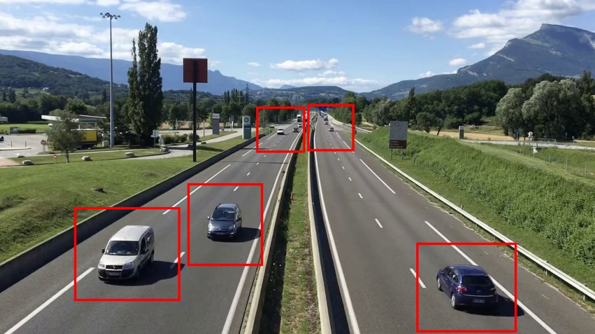
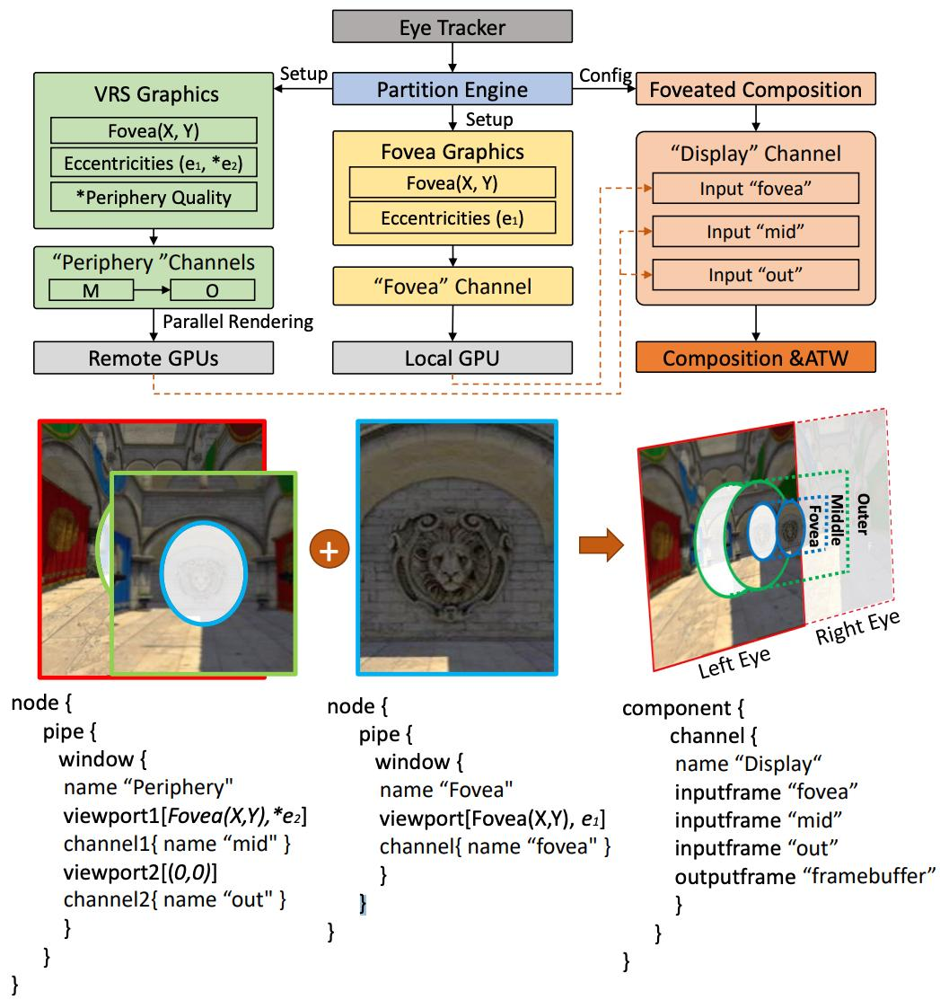
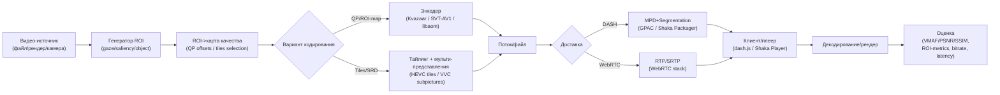

# ROI- и foveated video streaming: аналитическая и практическая база

## Executive summary

ROI-based (Region of Interest) и foveated (взоро-/фовеа-адаптивный) video streaming — это семейство подходов, где качество/битрейт распределяются неравномерно по кадру: максимум ресурсов получают “важные” области (ROI), а остальная периферия кодируется грубее, часто с опорой на физиологию зрения (фовеа) и/или трекинг взгляда. Практический эффект — снижение требуемого битрейта при сохранении воспринимаемого качества в зоне внимания и/или уменьшение вычислительной нагрузки в интерактивных сценариях (cloud gaming, VR/AR, телеметрия/дроны, видеонаблюдение). Это подтверждается работами по foveated streaming в cloud gaming и на “commodity” устройствах, а также системой/фреймворками для реального времени. [(1)](https://arxiv.org/abs/1706.04804)

Это исследование ставит перед собой цель — сравнить два класса ROI-механизмов:
- **QP/quality-map (in-frame ROI)**: задаётся карта смещения качества/квантования (на уровне блоков), применяется в энкодере; хорошо подходит для real-time (WebRTC/UDP) и “одиночного потока”. Пример: ROI/QP offset map в SVT-AV1, ROI map API в libaom, ROI (delta-QP map) в Kvazaar и SVT-AV1. [(2)](https://gitlab.com/AOMediaCodec/SVT-AV1/-/blob/master/Docs/Parameters.md) [(3)](https://github.com/ultravideo/kvazaar)
- **Tile/subpicture based (spatially addressable streaming)**: контент делится на tiles/подпотоки, клиент запрашивает/собирает только нужные части в высоком качестве (особенно в DASH/360/VR). Пример: MPEG-DASH SRD и демонстрации tile-based adaptation в GPAC с HEVC tiling. [(4)](https://biblio.telecom-paristech.fr/cgi-bin/download.cgi?id=16023)

В качестве практического ядра проекта можно собрать экспериментальный стенд на open-source инструментах: **FFmpeg + libvmaf** для оценки качества (в т.ч. автоматизация), **GPAC/Shaka Packager** для DASH-пакетирования, **SVT-AV1/Kvazaar** для ROI-кодирования, и **WebGazer/Pupil** (или датасеты взглядов) для источника gaze/ROI. [(5)](https://github.com/netflix/vmaf/blob/master/resource/doc/ffmpeg.md)

## Терминология и варианты архитектуры

### ROI vs foveated:

**ROI video coding/streaming** обычно означает “важная область задана заранее или вычислена алгоритмом” (детектор объектов, центр экрана), а **foveated** — частный случай ROI, где ROI соответствует области наибольшей остроты зрения вокруг текущей фиксации и может динамически перемещаться по gaze-tracker’у. В работах по foveated streaming подчёркивается различие между статическим ROI и динамическим gaze-driven распределением битов в реальном времени. [(6)](https://oliver-wiedemann.net/static/publications/wiedemann2020foveated.pdf)

### Два базовых “инженерных паттерна”

**Паттерн A: single-stream с картой качества (QP/Q-offset map)**  
1) Получаем ROI (gaze/детектор).  
2) Преобразуем ROI в карту по блокам (например, 64×64).  
3) Энкодер использует карту, чтобы усилить качество в ROI и ослабить вокруг.  

В SVT-AV1 это прямо реализовано как “RoiMapFile and QP Offset Map” (построчно, по кадрам, оффсеты на 64×64 блоки). [(2)](https://gitlab.com/AOMediaCodec/SVT-AV1/-/blob/master/Docs/Parameters.md)
В libaom это доступно как control-функция передачи ROI map в энкодер (AOME_SET_ROI_MAP). [(7)](https://aomedia.googlesource.com/aom/%2B/master/aom/aomcx.h#186)
В Kvazaar доступен параметр `--roi <filename>` (delta QP map), поддерживаются текстовый/бинарный форматы, масштабирование карты под видео и зацикливание чтения файла. [(8)](https://github.com/ultravideo/kvazaar/blob/master/README.md?plain=1#L162)

**Паттерн B: tiles/subpictures + выбор нужных частей на доставке (DASH)**  
Видео заранее кодируется так, чтобы отдельные части кадра (tiles) могли быть заменены/подгружены независимыми сегментами. “Spatial Relationship Description (SRD)” расширяет MPD в MPEG-DASH для описания пространственных отношений между “кусочками” видеоконтента, чтобы клиент выбирал только релевантные части (ROI/tiles) и нужные разрешения. [(9)](https://preview.sist.si/sist-preview/66486/612d55305c6840438ea09312982f73d5/ISO-IEC-23009-1-2014-Amd-2-2015.pdf)
GPAC демонстрирует HEVC motion-constrained tile-based adaptation: замена tile одного HEVC потока на tile другого качества с сохранением **HEVC-совместимости** собранного битстрима и необходимостью **одного декодера** на клиенте. [(10)](https://wiki.gpac.io/Howtos/dash/MPEG-DASH-SRD-and-HEVC-tiling-for-VR-videos/)

  
  

## Обзор научной литературы

Ниже — подборка оригинальных и обзорных работ за ~2011–2025 (приоритет: первоисточники, конференции/журналы/репозитории авторов). Русскоязычных **peer-reviewed** материалов именно по foveated streaming существенно меньше; в практической части полезны русскоязычные индустриальные материалы по оценке качества/кодеков и инструменты (например, Elecard, MSU).

### Таблица релевантных работ

<!-- TODO(Manabreaker): make it ieee style -->

----

| Название | авторы | дата | ссылка                                                                     |
|----------|--------|------|----------------------------------------------------------------------------|
|          |        |      | https://arxiv.org/pdf/2311.02656                                           |
|          |        |      | https://arxiv.org/pdf/1706.04804v1                                         |
|          |        |      | https://oliver-wiedemann.net/static/publications/wiedemann2020foveated.pdf |
|          |        |      | https://biblio.telecom-paristech.fr/cgi-bin/download.cgi?id=16023          |
|          |        |      | https://ient-common.pages.rwth-aachen.de/publications/pdf/BuFeSc13.pdf     |
|          |        |      |                                                                            |

### Что видно из литературы: “линии развития” на будущее

В 2016–2024 заметен переход от демонстрационных foveated прототипов к более системным, воспроизводимым пайплайнам с измерениями **latency**, устойчивости к ошибкам gaze-tracking и реальным интерактивным нагрузкам (cloud gaming, VR). [(11)](https://arxiv.org/abs/1706.04804) 
Параллельно компонент “доставка” (tiled/viewport adaptive) развивался в сторону “стандартизируемых” описаний пространственных компонентов в DASH (SRD) и практических демонстраций кросс-стрим сборки tiles без нарушения совместимости. [(4)](https://biblio.telecom-paristech.fr/cgi-bin/download.cgi?id=16023)

## Стандарты, кодеки и протоколы с механизмами для ROI

Ниже — “как именно” ROI/фовеация приземляются на стандарты. Важно: чаще всего ROI — это не отдельная “кнопка” в стандарте, а комбинация механизмов (tiles/slices/subpictures, scalability, encoder controls QP map, протокольные описания spatial objects).

### HEVC (H.265)

На стороне стандарта HEVC содержит механизмы **разбиения картинки** на slices/tiles и связанные процессы декодирования/сканирования, что является фундаментом для tile-based ROI delivery и параллелизма. Это отражено в структуре Rec. H.265 (partitioning of pictures into slices/tiles и др.). [(12)](https://www.compression.ru/video/seminar/slides/2012_h265_mv_hevc_overview.pdf)
На практике tile-based adaptation часто дополняется ограничениям на motion (motion-constrained tiles), чтобы было возможно “подменять” tile-части из потоков разного качества и собирать совместимый битстрим. Такой подход демонстрируется GPAC для HEVC tiling в контексте DASH. [(10)](https://wiki.gpac.io/Howtos/dash/MPEG-DASH-SRD-and-HEVC-tiling-for-VR-videos/)

### AV1

AV1 документирован как спецификация битстрима/декодирования от AV1 Bitstream & Decoding Process
Specification [(13)](https://aomediacodec.github.io/av1-spec/av1-spec.pdf)
С точки зрения ROI-реализаций на уровне энкодера, libaom предоставляет control для передачи ROI map в энкодер (`AOME_SET_ROI_MAP`). [(7)](https://aomedia.googlesource.com/aom/%2B/master/aom/aomcx.h#186)  
Для real-time/интерактива важно, что определены RTP payload форматы для AV1 (применимо в WebRTC/mediasoup-подобных системах), включая положения о scalability. [(14)](https://aomediacodec.github.io/av1-rtp-spec/v1.0.0.html)

### VVC (H.266)

Rec. H.266 описывает VVC как технологию следующего поколения, ориентированную на более широкий спектр применений, чем прошлые поколения. [(15)](https://www.itu.int/rec/dologin_pub.asp?lang=e&id=T-REC-H.266-202309-S!!PDF-E&type=items) 
Для ROI-подходов принципиально, что в спецификациях/конформанс-материалах и описаниях структуры VVC присутствуют сущности **subpictures/tiles/slices** (разбиение на уровне “подкартинок” и tiles) — это расширяет пространство для “пространственно адресуемого” кодирования/доставки (по аналогии с HEVC tiles, но с новыми конструкциями). [(16)](https://fastvdo.com/pubs/standards/T-REC-H.266-202008-I%21%21PDF-E.pdf)

### MPEG-DASH и SRD

MPEG-DASH стандартизован как ISO/IEC 23009-1; механизм SRD вводился как Amendment и описывает Spatial Relationship Description, позволяя в MPD обозначать spatial objects (например, ROI/tiles) и пространственные отношения между ними. [(17)](https://www.iso.org/standard/66486.html)
Практическая значимость SRD: клиент может выбирать и запрашивать только те spatial parts, которые важны для пользовательского опыта в данный момент (например, viewport/ROI), сочетая это с adaptive bitrate. [(4)](https://biblio.telecom-paristech.fr/cgi-bin/download.cgi?id=16023)

### WebRTC

W3C определяет WebRTC APIs для передачи/приёма медиа и данных, а транспортные аспекты RTP/профилей описаны в документах IETF (например, RFC о media transport в WebRTC). [(18)](https://www.w3.org/TR/webrtc/)
Для ROI/foveated в WebRTC нет “стандартизованного ROI”, но есть практическая связка: **real-time encoder controls + RTP + адаптация** (битрейт, keyframe, simulcast/SVC) — особенно при использовании AV1 (см. RTP payload format ). [(14)](https://aomediacodec.github.io/av1-rtp-spec/v1.0.0.html)

## Открытые проекты, инструменты и библиотеки

### Таблица GitHub/GitLab проектов

Примечание: статусы указаны по формулировкам репозиториев (under development/deprecated) и/или по активности релизов/коммитов, где это явно отражено.

| Проект                               | Ссылка                                          | Язык                      | Статус                                                     | Лицензия                          |
|--------------------------------------|-------------------------------------------------|---------------------------|------------------------------------------------------------|-----------------------------------|
| FFoveated                            | https://github.com/ultravideo/ffoveated         | C/C++ (FFmpeg-экосистема) | research workbench; build “неудобен”, README частично TODO | LGPL-3.0                          |
| Kvazaar (HEVC encoder)               | https://github.com/ultravideo/kvazaar           | C                         | still under development (активные релизы)                  | BSD-3-Clause                      |
| SVT-AV1                              | https://gitlab.com/AOMediaCodec/SVT-AV1         | C/C++                     | активный (коммиты/релизы), есть ROI map формат             | BSD + AOM patent license          |
| libaom (AOM AV1)                     | http://aomedia.googlesource.com/aom/            | C                         | референсная реализация AV1; есть ROI map control           | BSD-2-Clause + AOM patent license |
| VVenC (VVC encoder)                  | https://github.com/fraunhoferhhi/vvenc          | C++                       | активно развивается; сборка CMake/Makefile                 | BSD-3-Clause-Clear                |
| uvg266 (VVC encoder)                 | https://github.com/ultravideo/uvg266            | C                         | still under development                                    | BSD-3-Clause                      |
| OpenVVC (VVC decoder)                | https://github.com/OpenVVC/OpenVVC              | C                         | still under development                                    | LGPL-2.1                          |
| GPAC (packaging/streaming framework) | https://github.com/gpac/gpac                    | C                         | активный; есть SRD/tiling howto/demo                       | LGPL-2.1+                         |
| Shaka Packager                       | https://github.com/shaka-project/shaka-packager | C++                       | активный                                                   | BSD-3-Clause                      |
| dash.js (DASH player)                | https://github.com/Dash-Industry-Forum/dash.js  | JavaScript                | reference client; релизы выходят                           | BSD                               |
| Shaka Player (player)                | https://github.com/shaka-project/shaka-player   | JavaScript                | активный                                                   | Apache-2.0                        |
| WebGazer.js (webcam gaze)            | https://github.com/brownhci/WebGazer            | JavaScript                | активный; webcam gaze tracking                             | GPLv3 (+ LGPLv3 опция)            |
| Pupil (Pupil Labs open-source stack) | https://github.com/pupil-labs/pupil             | Python                    | активный community development                             | LGPL-3.0                          |
| ALVR (VR streaming)                  | https://github.com/alvr-org/ALVR                | Rust + C++                | активный (VR streaming over Wi-Fi)                         | MIT                               |
| VMAF (quality metric toolkit)        | https://github.com/Netflix/vmaf                 | C + Python                | активный                                                   | BSD+Patent                        |
| FFmpeg                               | https://github.com/FFmpeg/FFmpeg                | C                         | индустриальный стандарт de-facto                           | LGPL/GPL (зависит от сборки)      |

### Практические роли инструментов

**Энкодеры с ROI/QP map**
- Kvazaar (HEVC): `--roi <filename>` — файл карты delta QP (txt/bin), масштабирование карты и др.; также встречается `--erp-aqp` для 360 equirectangular.
- SVT-AV1: описан формат RoiMapFile/QP Offset Map file (frame number + QP offsets for each 64×64 block).
- libaom: control `AOME_SET_ROI_MAP` для подачи ROI map в энкодер.  

**DASH/tiling пайплайн**
- GPAC: LGPL, инструменты упаковки/стриминга; вики-демо описывает “HEVC Motion-constrained Tile-based adaptation” и работу с SRD/tiling.
- Shaka Packager: упаковка DASH/HLS, BSD-3-Clause.

**Оценка качества и ROI-aware анализ**
- VMAF + FFmpeg: VMAF поставляется как libvmaf, есть документация “Using VMAF with FFmpeg” (включение `--enable-libvmaf`), а also указано, что VMAF включён как фильтр FFmpeg.
- Сторонние (русскоязычные) инструменты оценки качества: Elecard упоминает сравнение PSNR/SSIM/VMAF и анализ “для заданной области интереса (ROI)”. [(19)](https://www.elecard.com/ru/products/video-analysis/video-quality-estimator)

**Трекинг взгляда и источники ROI**
- Pupil: позиционируется как open-source eye tracking platform; академическая статья описывает архитектуру платформы. [(20)](https://github.com/pupil-labs/pupil )  
- WebGazer.js: browser-based webcam gaze estimation; лицензирование отражено в репозитории. [(21)](https://github.com/brownhci/WebGazer)

**Аппаратные/SDK ROI (в будущем полезно для real-time на железе)**
- NVIDIA: NVENC programming guide описывает программирование NVENC через NVENCODE APIs; на Jetson доступен API/структуры ROI параметров через V4L2 NV Extensions. [(22)](https://docs.nvidia.com/video-technologies/video-codec-sdk/13.0/nvenc-video-encoder-api-prog-guide/index.html#)
- Qualcomm: документация по ROI encoding на Snapdragon описывает, что приложение может задавать множественные ROI и QP bias по кадрам. [(23)](https://docs.qualcomm.com/bundle/publicresource/topics/80-56386-10/roi.html)

## Данные и метрики для экспериментов

### Рекомендуемые наборы данных

Практично разделить данные на 3 группы: **(A) видео-контент**, **(B) gaze/head-tracking**, **(C) сетевые условия/ABR**.

### Таблица датасетов

| Набор данных                                            | Ссылка                                                | Размер                               | Формат                                   | Лицензия                         |
|---------------------------------------------------------|-------------------------------------------------------|--------------------------------------|------------------------------------------|----------------------------------|
| UVG 4K dataset (16 последовательностей, 4K 50/120 fps)  | https://ultravideo.fi/dataset.html                    | N/A (raw 4K, зависит от seq)         | raw YUV 8/10-bit 4:2:0                   | CC BY-NC                         |
| Xiph.org Test Media (lossless)                          | https://media.xiph.org/                               | напр. Tears of Steel: Y4M 4K ≈ 67 GB | Y4M/PNG/TIFF/EXR (по клипу)              | CC BY (для Blender open movies)  |
| Big Buck Bunny (open movie)                             | https://peach.blender.org/download/                   | varies (lossless/4K)                 | Y4M/прочие                               | CC BY 3.0                        |
| Sintel (open movie)                                     | https://durian.blender.org/download/                  | varies (есть 4K версии)              | Y4M/прочие                               | CC BY 3.0                        |
| Tears of Steel (open movie)                             | https://mango.blender.org/download/                   | 4K Y4M ~67 GB (на Xiph)              | Y4M/EXR/…                                | CC BY 3.0                        |
| DIEM (Dynamic Images and Eye Movements)                 | http://thediemproject.wordpress.com/                  | N/A                                  | gaze fixations/eye tracking data + видео | условия на сайте                 |
| Hollywood2 / Eye movements dataset (Coutrot & Guyader)  | http://antoinecoutrot.magix.net/public/databases.html | N/A                                  | gaze data по видео                       | условия на сайте автора          |
| Head movement dataset for 360 videos (Corbillon et al.) | https://dash.ipv6.enstb.fr/headMovements/             | N/A                                  | head-tracking traces                     | условия на странице проекта      |
| VQA-OV (quality + omnidirectional with eye/head)        | https://github.com/thu-nics/VQA-OV                    | N/A                                  | 360-контент + eye/head tracking          | условия репозитория              |
| DASH Dataset (Lederer et al.)                           | https://dash.ipv6.enstb.fr/dataset/                   | N/A                                  | сегменты/MPD/репрезентации               | описано в публикации/репозитории |

### Метрики: что измерять и как “не ошибиться” методологически

**Объективные метрики качества (full-frame)**  
- PSNR, SSIM — стандартные full-reference метрики (часто используются в кодек-сравнениях). [(19)](https://www.elecard.com/ru/products/video-analysis/video-quality-estimator)
- VMAF — перцептуальная метрика от Netflix; реализована как libvmaf и доступна из FFmpeg (libvmaf filter), включая инструкции сборки. [(5)](https://github.com/netflix/vmaf/blob/master/resource/doc/ffmpeg.md)

**ROI-aware метрики (ключевые)**  
Рекомендуется вести **две “оси” качества**:
1) качество **внутри ROI** (ROI-PSNR/ROI-SSIM/ROI-VMAF: считать метрику только по маске ROI),  
2) качество **вне ROI** (для контроля артефактов/“заметного” падения).  

Практическая мотивация ROI-оценки видна и в индустриальных инструментах (упоминание анализа SSIM/PSNR/VMAF для заданной области интереса). [(19)](https://www.elecard.com/ru/products/video-analysis/video-quality-estimator)  

**Сетевые и системные метрики (для streaming, особенно интерактивного)**
- bitrate (средний, p95/p99), “rate variability”;  
- latency (end-to-end: capture→encode→send→decode→display), jitter;  
- stall ratio / rebuffering events (для DASH);  
- computational cost: CPU time/frame, GPU utilization, energy (если возможно).  
Эти измерения центральны в исследованиях cloud gaming/real-time graphics streaming, где latency критичен.

**Субъективная QoE**
- ACR/DSM подходы (в зависимости от масштаба и возможностей лаборатории);  
- отдельная фиксация “заметности” периферийных артефактов и “ошибок фиксации” (gaze error) — это часто принципиально для foveated. [(6)](https://oliver-wiedemann.net/static/publications/wiedemann2020foveated.pdf)

## Методология эксперимента, структура отчёта и риски

### Исследовательские гипотезы

H1. **ROI/foveated кодирование снижает битрейт** при неизменном (или почти неизменном) субъективном качестве в области интереса по сравнению с равномерным кодированием. Эта гипотеза согласуется с результатами foveated streaming в cloud gaming и commodity streaming работах.

H2. **Выигрыш зависит от параметризации ROI** (радиус, профиль деградации, “ступенчатость” vs гладкая функция) и от точности/задержки трекинга взгляда. 

H3. Эффективность tile-based ROI delivery относительно QP-map зависит от сценария применения: в viewport-based VOD и 360° streaming tile-based подход ожидаемо эффективнее по использованию сетевого трафика и доставке только релевантных областей, тогда как в latency-sensitive интерактивных сценариях single-stream QP-map подход ожидаемо предпочтительнее по end-to-end latency и сложности реализации.

H4. **При ошибках предсказания/измерения ROI** (неверный взгляд/ROI) наблюдается скачкообразное падение QoE даже при хорошем среднем битрейте; требуются механизмы “страховки” (увеличение ROI, сглаживание, prefetch/overfetch).

### Переменные и сценарии эксперимента

Независимые переменные (изменяемые):
- Энкодер/кодек: HEVC (Kvazaar/x265), AV1 (SVT-AV1/libaom), VVC (VVenC/uvg266 для отдельной ветки).
- Способ ROI:
  - ROI-map/QP offsets (block-based)
  - tiles/substreams + SRD (DASH)  
- Формирование ROI:
  - gaze-driven (Pupil/WebGazer или dataset gaze)  
  - saliency/object-based (OpenCV/детекторы; как “псевдо-gaze”)
- Параметризация ROI: радиус (в градусах или пикселях), уровни качества (центр/средняя зона/периферия), частота обновления ROI.

Зависимые переменные (измеряемые):
- bitrate, latency, CPU/GPU cost;
- ROI-VMAF/ROI-PSNR/ROI-SSIM и full-frame метрики;  
- QoE: субъективные оценки, “заметность” артефактов, частота “ошибок фиксации” (самое важное).  

Сценарии:
- Cloud gaming / remote desktop (интерактив, latency-sensitive).
- VR/360 VOD streaming (viewport/tiles).
- “Операторский” поток (дрон/робот): часто один наблюдатель, ROI вокруг центра/указателя, высокая ценность при ограниченной полосе. (FFoveated прямо называет подобные сценарии). [(24)](https://github.com/owdmn/FFoveated) 

### Конфигурация кодирования: предлагаемый “базовый” протокол

1) **Контент**: выбрать 3–6 клипов 1080p и 4K (как минимум один “сложный” по движению и один “спокойный”), например из UVG и Xiph.
2) **Базовая линия**: uniform encoding (фиксированный QP или CRF-подобный режим), без ROI.  
3) **ROI вариант**:  
   - для Kvazaar: `--roi roi.txt` (delta-QP map),  
   - для SVT-AV1: RoiMapFile/QP offsets,  
   - для libaom: ROI map control на уровне API.
4) **Доставка**:  
   - офлайн: DASH packaging (GPAC/Shaka Packager),  
   - интерактив: WebRTC профилирование (как минимум транспортно/архитектурно обосновать через W3C+RFC), если реализовывать невозможно — имитировать сетевые условия + измерять “энкодер->декодер” задержку локально.
5) **Оценка**:  
   - full-frame VMAF/PSNR/SSIM,  
   - ROI-VMAF/ROI-PSNR/ROI-SSIM по маске ROI,  
   - bitrate/latency/[CPU/GPU]-time.

### Mermaid-диаграмма потока данных

### Структура отчёта и презентации для вуза

**Рекомендуемая структура отчёта**
- Введение: мотивация ROI/foveated для интерактивного видео, постановка задачи/ограничения, цели и вклад проекта.  
- Обзор литературы: систематизация (ROI-map vs tiled delivery, cloud gaming vs VR vs lecture streaming), сравнительная таблица работ.
- Теория и стандарты: HEVC/VVC разбиение (tiles/subpictures), AV1 спецификация и ROI map control, DASH SRD, WebRTC транспорт.
- Реализация стенда: выбранные инструменты (энкодер, упаковка, плеер, трекер взгляда), схема пайплайна, формат ROI maps, воспроизводимость.
- Эксперименты: дизайн, гипотезы, переменные, сценарии, параметры кодирования, сетевые профили, методика оценок. 
- Результаты: графики bitrate↔качество (ROI и full), latency breakdown, вычислительная стоимость; обсуждение trade-offs.
- Заключение и будущая работа: что применимо на практике, что переносимо на VVC/новые протоколы, какие ограничения. 

**Приложения**
- конфиги энкодеров, скрипты генерации ROI map, команды упаковки DASH, версии библиотек, хэши, описание аппаратной платформы;  
- таблицы “параметры эксперимента” и “профили сетевых условий”.

**Слайды (10–15 минут)**
- 1–2 слайда мотивации и постановки;  
- 1 слайд taxonomy (ROI-map vs tiles);  
- 1 слайд стандарты (HEVC/AV1/VVC + DASH SRD + WebRTC);  
- 2–3 слайда стенда (mermaid + stack);  
- 3–4 слайда результатов (качество vs битрейт, latency, CPU);  
- 1 слайд выводов и рисков.

### Открытые вопросы и риски

**Точность и задержка gaze/ROI**: даже небольшая ошибка может переносить “высокое качество” не туда; литература по QoE foveated подчёркивает методологические сложности и важность корректной постановки субъективных тестов. [(25)](https://dl.acm.org/doi/fullHtml/10.1145/3379157.3391656)

**Гранулярность ROI**: block-based карты (64×64 или CU level) могут давать границы/артефакты на стыках.

**Сложность tiled delivery**: DASH SRD/HEVC tiling требует аккуратной подготовки контента (равные конфигурации tiles, constraints на motion) и инфраструктуры упаковки/проигрывания; GPAC демонстрирует работоспособность, но интеграционная стоимость выше. 

**Сравнимость метрик**: VMAF/PSNR/SSIM могут давать различную чувствительность к “периферийным” деградациям; важно явно фиксировать: (a) ROI-метрики, (b) full-frame, (c) субъективную оценку. 

**Лицензии и совместимость сборки**: FFmpeg режим LGPL/GPL зависит от включённых опций; VMAF и некоторые энкодеры имеют специфические лицензии (BSD+Patent, GPL и т.п.) — это критично при публикации кода/артефактов и выборе зависимостей.  

**Доступность VVC**: VVC стек сложнее и тяжелее по вычислениям, но открытые энкодеры/декодеры (VVenC/OpenVVC, uvg266) позволяют строить “ветку будущего” и обсуждать перспективы.
